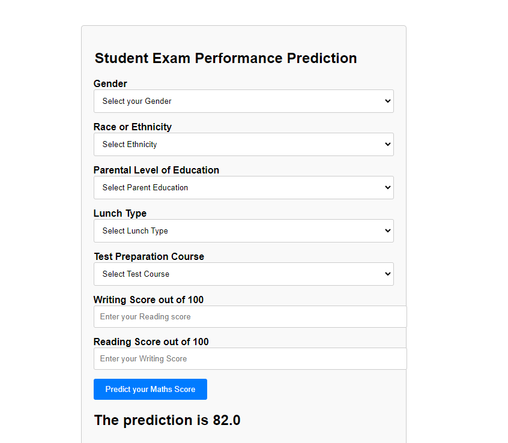

# Student Performance Indicator Project Documentation

## Table of Contents

1. [Introduction](#Introduction)
2. [Project Overview](#Project-Overview)
3. [Installation](#Installation)
4. [Usage](#Usage)
5. [File Structure](#FileStructure)
6. [Components](#Components)
    - [Data Ingestion](#Data-Ingestion)
    - [Data Transformation](#Data-Transformation)
    - [Model Training](#Model-Training)
    - [Prediction Pipeline](#Prediction-Pipeline)
7. [Web Application](#Web-Application)
8. [Dependencies](#Dependencies)
9. [Screenshots](#Screenshots)
9. [Contributing](#Contributing)
10. [Credits](#Credits)

## Introduction 

This documentation provides an overview of the "Student Performance Indicator" project, detailing its purpose, functionalities, usage instructions, and file structure.

## Project Overview 

The "Student Performance Indicator" project aims to analyze the factors affecting students' performance on exams. It leverages machine learning techniques to predict students' test scores based on various attributes such as gender, ethnicity, parental level of education, lunch type, and test preparation course. The project comprises several components, including data ingestion, data transformation, model training, and a prediction pipeline. Additionally, it includes a Flask web application for interactive prediction of student test scores.

## Installation 

To run the project, follow these steps:
1. Clone the repository: `git clone https://github.com/your-username/student-performance-indicator.git`
2. Navigate to the project directory: `cd student-performance-indicator`
3. Activate a virtual environment: `conda activate venv/`
4. Install dependencies: `pip install -r requirements.txt`

## Usage 

To use the project, follow these steps:
1. Ensure that all dependencies are installed.
2. Run the Flask web application: `python app.py`
3. Access the web application in your browser at `http://localhost:5000/`

## File Structure 

The project's file structure is organized as follows:
```
student-performance-indicator/
│
├── app.py
├── venv
├── README.md
├── requirements.txt
├── src/
│   ├── components/
│   │   ├── data_ingestion.py
│   │   ├── data_transformation.py
│   │   ├── model_trainer.py
│   │   └── pipeline/
│   │       └── predict_pipeline.py
│   ├── exception.py
│   ├── logger.py
│   └── utils.py
├── templates/
│   ├── index.html
│   └── home.html
└── artifacts/
    ├── model.pkl
    ├── preprocessor.pkl
    └── raw_data.csv
```

## Components

### Data Ingestion

The data ingestion component (`data_ingestion.py`) is responsible for fetching the raw data from a specified source and splitting it into train and test datasets.

1. **Configuration Setup**:
    - Defines a `DataIngetionConfig` data class to hold configuration parameters related to data ingestion such as file paths for train, test, and raw data.

2. **DataIngestion Class**:
    - Initializes with the `DataIngetionConfig` to manage configuration parameters.
    - Contains a method `initiate_data_ingestion()` responsible for performing the data ingestion process.

3. **Data Ingestion Process**:
    - Reads the raw data from the CSV file `stud.csv`.
    - Creates directories for storing train, test, and raw data if they don't exist already.
    - Splits the data into train and test sets using `train_test_split` from `sklearn.model_selection`.
    - Saves the raw, train, and test datasets into CSV files in the specified paths.
    - Logs information about the data ingestion process.

4. **Exception Handling**:
    - Catches and handles exceptions that might occur during data ingestion, logging the errors.

5. **Main Execution**:
    - Instantiates the `DataIngestion` class.
    - Calls the `initiate_data_ingestion()` method to perform data ingestion.
    - Obtains paths for the train and test datasets.
    - Calls methods from other components (`DataTransformation` and `ModelTrainer`) for further processing.

6. **Integration with Other Components**:
    - Interacts with other components such as `DataTransformation` and `ModelTrainer` by passing the train and test data paths to them for subsequent processing.

Overall, this file encapsulates the process of reading raw data, splitting it into train and test sets, and saving them into separate CSV files. It serves as the initial step in the machine learning pipeline, providing clean data for further analysis and model training.

### Data Transformation

The `data_transformation.py` file handles the data transformation process for the "Student Performance Indicator" project. Here's a summary of the key processes happening in this file:

1. **Configuration Setup**:
    - Defines a `DataTransformationConfig` data class to hold configuration parameters related to data transformation, such as the file path for saving the preprocessor object.

2. **DataTransformation Class**:
    - Initializes with the `DataTransformationConfig` to manage configuration parameters.
    - Contains methods for performing data transformation and obtaining the preprocessor object.

3. **Data Transformation Process**:
    - Defines numerical and categorical columns for preprocessing.
    - Constructs separate pipelines for numerical and categorical features using `Pipeline` from `sklearn.pipeline`.
    - Uses `ColumnTransformer` from `sklearn.compose` to apply different preprocessing steps to numerical and categorical columns.
    - Imputes missing values and scales numerical features using `SimpleImputer` and `StandardScaler`.
    - Encodes categorical features using `OneHotEncoder`.
    - Logs information about the categorical and numerical columns being processed.

4. **Exception Handling**:
    - Catches and handles exceptions that might occur during data transformation, logging the errors.

5. **Initiation of Data Transformation**:
    - Reads the training and testing data from CSV files.
    - Calls `get_data_transformer_object()` to obtain the preprocessor object.
    - Splits the datasets into input features and target features.
    - Applies the preprocessor object to transform the input features for both the training and testing datasets.
    - Combines the transformed input features with the target features.
    - Saves the preprocessor object using a utility function `save_object()`.

6. **Integration with Other Components**:
    - Returns the transformed training and testing datasets along with the file path of the saved preprocessor object for further processing by other components.

The data transformation component (`data_transformation.py`) preprocesses the data by performing tasks such as imputation, scaling, and encoding categorical variables.

### Model Training
The model training component (`model_trainer.py`) trains machine learning models on the preprocessed data using techniques like grid search for hyperparameter tuning.

1. **Configuration Setup**:
    - Defines a `ModelTrainerConfig` data class to hold configuration parameters related to model training, such as the file path for saving the trained model.

2. **ModelTrainer Class**:
    - Initializes with the `ModelTrainerConfig` to manage configuration parameters.
    - Contains a method `initiate_model_trainer()` responsible for training and evaluating machine learning models.

3. **Model Training and Evaluation Process**:
    - Splits the input arrays into training and testing datasets.
    - Defines a dictionary of machine learning models to be trained, including Random Forest, Decision Tree, Gradient Boosting, Linear Regression, XGBoost, CatBoost, and AdaBoost.
    - Defines parameters for hyperparameter tuning for each model using a dictionary.
    - Evaluates each model using the `evaluate_models()` function, which trains each model with different hyperparameters, evaluates them using R-squared score on the test set, and returns a dictionary containing model names and corresponding R-squared scores.
    - Selects the best-performing model based on the highest R-squared score on the test set.
    - If the best model's R-squared score is below 0.6, raises an exception indicating that no suitable model was found.
    - Saves the trained best model using a utility function `save_object()`.

4. **Exception Handling**:
    - Catches and handles exceptions that might occur during model training and evaluation, logging the errors.

5. **Return Value**:
    - Returns the R-squared score of the best-performing model on the test set.

Overall, this file encapsulates the process of training multiple machine learning models, tuning their hyperparameters, selecting the best-performing model based on evaluation metrics, and saving the trained model for future use. It serves as a crucial component in the machine learning pipeline for predicting student performance indicators.

### Prediction Pipeline

The prediction pipeline (`predict_pipeline.py`) utilizes the trained model and preprocessor to make predictions on custom data inputs.

The `predictive_pipeline.py` file contains two main classes: `PredictPipeline` and `CustomData`. Here's a summary of the key processes happening in this file:

### `PredictPipeline` Class:

1. **Initialization**:
   - The `PredictPipeline` class is initialized without any parameters.

2. **Prediction Process**:
   - Contains a method `predict(features)` responsible for making predictions using a trained machine learning model.
   - Retrieves the paths of the trained model and preprocessor object from the `artifacts` directory.
   - Loads the trained model and preprocessor using the `load_object` utility function from `src.utils`.
   - Transforms the input features using the preprocessor.
   - Makes predictions using the trained model on the transformed features.
   - Returns the predictions.

### `CustomData` Class:

1. **Initialization with Custom Data**:
   - The `CustomData` class represents a custom data input for prediction.
   - Initialized with specific attributes such as gender, race_ethnicity, parental_level_of_education, lunch, test_preparation_course, reading_score, and writing_score.

2. **Data Frame Conversion**:
   - Contains a method `get_data_as_data_frame()` responsible for converting the custom data input into a pandas DataFrame.
   - Constructs a dictionary representing the custom data input.
   - Creates a DataFrame from the dictionary.


## Web Application 
The Flask web application (`app.py`) provides a user-friendly interface for interacting with the machine learning model. Users can input data through a form, and the application returns predictions based on the input.

## Dependencies 

The project relies on the following dependencies:
- Flask
- pandas
- scikit-learn
- dill
- numpy
- catboost
- xgboost


## Screenshots




## Contributing

Contributions to the project are welcome. Fork the repository, make your changes, and submit a pull request.

## Credits

This project Credit goes to Krish Naik youtube Channel